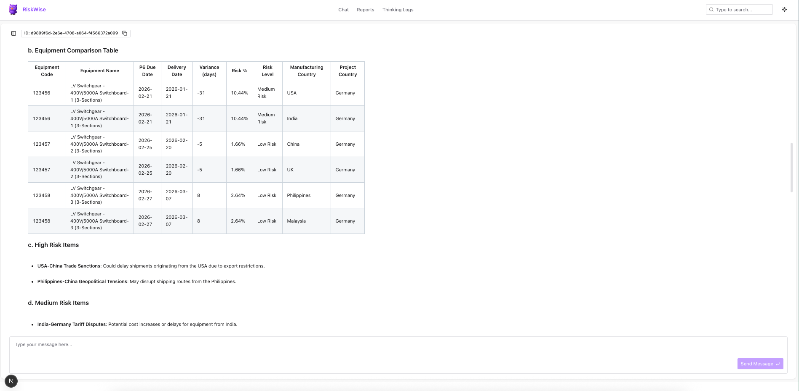
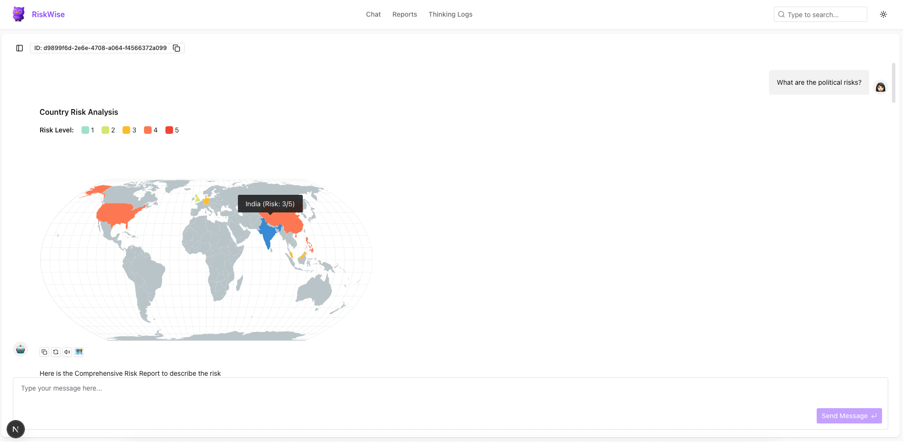
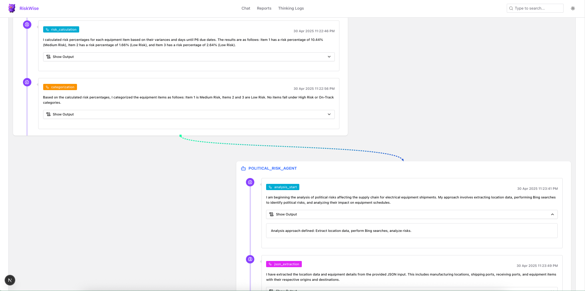
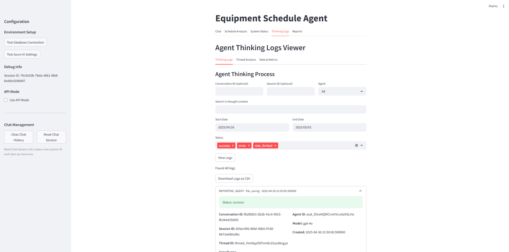
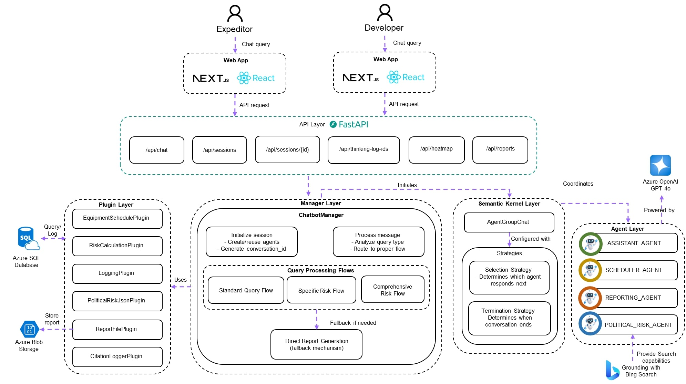

# RiskWise: Procurement Risk Analysis System
<p align="center">
  
</p>

## Overview
RiskWise is a proof-of-concept Agentic AI application built for today's volatile global landscape, designed to support expeditors with near real-time, explainable market and risk intelligence across global supply chains. Instead of replacing human decision-makers, RiskWise acts as an intelligent assistant — continuously monitoring geopolitical events, labor conditions, tariffs, and logistics disruptions to surface early warnings. 

Expeditors can ask natural language questions and receive structured, visual insights grounded in current data and verified sources. It is a multi-agent AI system that transforms how organizations manage equipment delivery risks across global supply chains. 

By leveraging Azure AI Projects and specialized AI agents, it delivers comprehensive risk assessment by analyzing:

- **Schedule variances** - Identifying delivery timeline risks
- **Political factors** - Real-time geopolitical risk insights via Bing Search
- **Tariff changes** - Monitoring trade policy impacts on procurement
- **Logistics disruptions** - Tracking shipping and transportation challenges

## Semantic Kernel Multi-Agent Flow

This section outlines the agent triggering and flow orchestration based on natural language queries in the Equipment Schedule Risk system.

### Agent Definitions

- **ASSISTANT_AGENT**: Handles general queries, greetings, and fallback responses.
- **SCHEDULER_AGENT**: Analyzes equipment schedule data and calculates delivery risks.
- **POLITICAL_RISK_AGENT**: Evaluates political risks based on manufacturing/project countries using Bing Search.
- **REPORTING_AGENT**: Synthesizes insights from other agents into a comprehensive report.

### Selection Strategy & Agent Flow

The system uses `ChatbotSelectionStrategy` and `ChatbotTerminationStrategy` to determine which agent responds next and when to end the conversation.

#### 1. General Queries and Greetings

**Example**: `"Hello, can you help me?"`

**Flow**:
```
User Query → ASSISTANT_AGENT → End Conversation
```

When a general query is detected:
1. `ChatbotSelectionStrategy` analyzes the message and routes to ASSISTANT_AGENT
2. ASSISTANT_AGENT provides a helpful response
3. `ChatbotTerminationStrategy` ends the conversation after the assistant responds

#### 2. Schedule Risk Queries

**Example**: `"What are the schedule risks?"`

**Flow**:
```
User Query → SCHEDULER_AGENT → REPORTING_AGENT → End Conversation
```

When schedule risk is requested:
1. `ChatbotSelectionStrategy` identifies a schedule-specific query
2. SCHEDULER_AGENT calculates risk percentages and categorizes equipment items
3. SCHEDULER_AGENT output is automatically passed to REPORTING_AGENT
4. REPORTING_AGENT formats the analysis into a comprehensive report
5. Conversation ends after reporting completes


#### 3. Political Risk Queries

**Example**: `"What are the political risks?"`

**Flow**:
```
User Query → SCHEDULER_AGENT → POLITICAL_RISK_AGENT → REPORTING_AGENT → End Conversation
```

For political risk analysis:
1. `ChatbotSelectionStrategy` routes first to SCHEDULER_AGENT for context
2. SCHEDULER_AGENT extracts country data and equipment information
3. This structured data is formatted as JSON and passed to POLITICAL_RISK_AGENT
4. POLITICAL_RISK_AGENT performs Bing searches for relevant political news
5. POLITICAL_RISK_AGENT analyzes results and provides risk assessment with citations
6. REPORTING_AGENT combines schedule and political data into a final report
7. Conversation ends after the report is delivered


### Technical Implementation Details

- **Thread Management**: The system tracks conversation threads to maintain context
- **Rate Limiting**: `RateLimitedExecutor` prevents overloading external services
- **Error Handling**: Includes retry logic and fallback mechanisms
- **Thinking Process Logging**: Each agent logs reasoning steps using `log_agent_thinking`
- **Timeout Controls**: Agents have individual and overall timeouts to prevent hanging


### Agent Message Processing

```
User Message → ChatbotManager.process_message() → _analyze_query_type() → _process_specific_risk_query() or _process_standard_query()
```

The system:
1. Analyzes query intent using keyword detection
2. Selects appropriate agent sequence based on query type
3. Manages conversation flow between agents
4. Handles error conditions and timeouts
5. Returns final agent response to user

This agent architecture enables specialized risk analysis while maintaining a cohesive conversation flow, allowing each agent to focus on its area of expertise.


## Backend Technologies

- **Azure AI Agent Service** – Foundation for orchestrating specialized multi-agent workflows in a modular architecture  
- **Azure OpenAI Service** – Provides large language models for natural language understanding, reasoning, and content generation  
- **Azure AI Foundry Playground** – Visual interface to test and prototype agent behaviors and workflows before deployment  
- **Semantic Kernel** – Lightweight orchestration framework for integrating AI plugins and managing agent memory and context  
- **Grounding with Bing Search** – Real-time web search grounding for up-to-date geopolitical and logistical risk insights  
- **Azure Blob Storage** – Secure storage for generated reports, configuration files, and agent artifacts  
- **Azure SQL Database** – Centralized, structured database for schedules, equipment metadata, and risk analysis results  
- **FastAPI** – High-performance Python web framework for building APIs with automatic documentation  
- **Streamlit** – Developer-focused interface for testing, monitoring, and debugging agent behavior in real time  
- **Spire.Doc.Free** – Free library for creating and manipulating Word documents programmatically  
- **PyODBC** – Python library for connecting to SQL Server databases  

## Frontend Technologies

- **React** – Frontend UI library used to build interactive, component-based interfaces  
- **Next.js** – Full-stack React framework used for routing, API integration, and optimized frontend performance  
- **Tailwind CSS** – Utility-first CSS framework for rapidly building custom designs without leaving HTML  
- **React Simple Maps** – JavaScript charting library for data visualization

## Development Tools

- **Visual Studio Code** – Lightweight code editor with extensive plugin support  
- **Postman** – API testing and documentation tool  
- **Git** – Distributed version control system
  
## Business Impact

RiskWise solves critical business challenges by:

- **Preventing costly delays** - Proactively identify equipment delivery risks before they impact projects
- **Providing early warning** - Get timely alerts on emerging political, tariff, and logistics issues
- **Simplifying collaboration** - Create shareable, structured documentation for procurement teams
- **Supporting data-driven decisions** - Make procurement choices backed by comprehensive risk analysis
- **Reducing supply chain disruptions** - Address potential issues before they affect project timelines

## Key Features

### Intelligent Multi-Agent Analysis
- Specialized agents collaborate to deliver comprehensive risk assessment
- Each agent focuses on specific risk domains (schedule, political, tariff, logistics)
- Consolidated reporting synthesizes insights into actionable recommendations

### Interactive Risk Analysis



- Conversational interface for natural risk queries and analysis
- Real-time political risk intelligence using Bing Search integration
- Automatic calculation of schedule variances and risk levels
- Detailed recommendations for risk mitigation

### Professional Report Generation


- Automatically generate formatted Word documents with risk analysis
- Store reports centrally in Azure Storage for easy access
- Track report history and filter by project, equipment, or date
- Share reports with stakeholders via secure download links

### Advanced Visualization



- Interactive heatmaps showing risk distribution by country
- Schedule variance charts highlighting delivery timeline issues
- Risk impact assessment matrices for severity understanding
- Trend analysis to identify emerging risk patterns

### Transparent AI Reasoning



- Complete visibility into AI decision processes
- Verification of information sources with citation tracking
- Comprehensive audit trail of system operations
- Identify reasoning behind specific recommendations

### Developer View via Streamlit




- **System Testing Dashboard**: Interactive UI to validate Azure connections and database settings
- **Environment Diagnostics**: Visual indicators for successful connection tests
- **Error Visualization**: User-friendly display of system errors and troubleshooting guidance
- **Session Management**: View active sessions and conversation IDs for debugging
- **Thinking Log Explorer**: Interactive tool for examining agent reasoning in detail

The Developer View is built directly into the Streamlit interface, providing a convenient way for developers to test, monitor, and troubleshoot the system without requiring separate tools or command-line access.

## System Components


The system consists of several interrelated components that work together to provide comprehensive risk analysis. The system follows a modular, multi-agent design pattern:

### Agent Layer
- **Scheduler Agent** - Processes equipment data, calculates variances, determines risk levels
- **Political Risk Agent** - Identifies geopolitical factors affecting supply chains
- **Reporting Agent** - Consolidates findings into structured, actionable reports
- **Assistant Agent** - Manages conversation flow and user interaction

### Manager Layer
- **Chatbot Manager** - Orchestrates agent interaction for chat sessions

### Plugin Layer
- **Schedule Plugin** - Processes equipment schedule data
- **Risk Plugin** - Performs calculation and categorization
- **Logging Plugin** - Manages agent thinking and events
- **Report File Plugin** - Generates Word documents and handles storage
- **Citation Handler Plugin** - Tracks citations from Bing Search results

### API & Interface Layer
- **FastAPI Application** - RESTful endpoints for system integration
- **Streamlit Interface** - Interactive user experience for developers during development

## Responsible AI Components in RiskWise

RiskWise incorporates several Responsible AI features to ensure transparency, accountability, and user trust in its supply chain risk assessment workflows:

- **Transparent Reasoning Process**  
  Logs each step of the AI reasoning pipeline (e.g., `risk_calculation`, `categorization`, `analysis_start`) with timestamps. This allows users to trace how each conclusion is reached.

- **Visual Explainability**  
  Uses color-coded risk levels (1–5 scale) and a global map to visualize geographic risk distribution. This simplifies complex information into intuitive visual cues for fast interpretation.

- **Interactive Exploration**  
  Provides expandable "Show Output" sections and interactive map elements to let users explore regional details and understand the reasoning behind risk ratings.

- **Structured Agent Reasoning**  
  Maintains a clear separation between each agent’s reasoning steps and its final conclusions. Intermediate steps are logged and auditable for transparency and reproducibility.

- **Decision Criteria Transparency**  
  Clearly documents how each risk is calculated and categorized, including threshold values and logic. This ensures users can understand and verify all recommendations.

These Responsible AI practices enhance user confidence in RiskWise's assessments and support ethical, auditable AI deployment in critical decision-making scenarios.

## Quick Start

### Prerequisites

- Python 3.11
- Azure AI Projects account with model deployment
- SQL Server database
- Azure Storage account (for report storage)
- Bing Search API key (for political risk analysis)

### Installation

```bash
# Clone repository
git clone https://github.com/yourusername/azure-ai-agent-hackathon-2025.git

# Create and activate virtual environment
python -m venv .venv
source .venv/bin/activate  # On Windows: .venv\Scripts\activate

# Install dependencies
pip install -r backend/requirements.txt
```

User Mode: 
```bash
cd frontend/
npm install
```

### Environment Setup

Create a `.env` file with your configuration:

```
AZURE_AI_AGENT_PROJECT_CONNECTION_STRING=your_connection_string
AZURE_AI_AGENT_MODEL_DEPLOYMENT_NAME=your_model_deployment
DB_CONNECTION_STRING=your_db_connection_string
AZURE_STORAGE_CONNECTION_STRING=your_storage_connection_string
BING_SEARCH_API_KEY=your_bing_api_key
```

### Running the Application
User Mode: 
```bash
cd frontend/
npm run dev
```

Run the FastAPI server:
```bash
cd api/
python api_server.py
```

Dev Mode:
```bash
cd backend/

# start the Streamlit interface
streamlit run streamlit_app.py
```

## Project Structure
```
frontend/
├── app/ # Next.js app directory (pages and routing)
├── components/ # Reusable React components
├── hooks/ # Custom React hooks
├── lib/ # Utility functions and shared logic
├── public/ # Static assets
├── .next/ # Next.js build output
├── node_modules/ # Dependencies
├── tailwind.config.js # Tailwind CSS configuration
├── tsconfig.json # TypeScript configuration
├── next.config.ts # Next.js configuration
├── postcss.config.mjs # PostCSS configuration
├── package.json # Project dependencies and scripts
└── eslint.config.mjs # ESLint configuration
```

```
backend/
├── agents/                    # Agent definitions and strategies
│   ├── agent_definitions.py   # Instructions for each specialized agent
│   ├── agent_manager.py       # Agent creation and management functions
│   └── agent_strategies.py    # Selection and termination logic for agent groups
├── api/                       # API components
│   ├── app.py                 # FastAPI application setup
│   ├── endpoints.py           # API route definitions
│   └── api_server.py          # Standalone API server
├── config/                    # Configuration components
│   ├── settings.py            # Environment and application settings
│   └── __init__.py            # Configuration module initialization
├── managers/                  # System managers
│   ├── chatbot_manager.py     # Chat interaction handling
│   ├── scheduler.py           # Workflow scheduling
│   └── workflow_manager.py    # Automated workflow management
├── plugins/                   # Semantic Kernel plugins
│   ├── citation_handler_plugin.py   # Citation extraction and formatting
│   ├── logging_plugin.py            # Thinking and event logging
│   ├── political_risk_json_plugin.py # Political risk data processing
│   ├── report_file_plugin.py        # Report generation and storage
│   ├── risk_plugin.py               # Risk calculation functions
│   └── schedule_plugin.py           # Schedule data retrieval and processing
├── utils/                     # Utility functions
│   ├── database_utils.py      # Database connection management
│   └── thinking_log_viewer.py # Streamlit component for viewing agent thinking
├── main.py                    # Application entry point
├── streamlit_app.py           # Streamlit UI application
└── requirements.txt           # Project dependencies
```

## License

This project is licensed under the Apache License 2.0 - see the [LICENSE](LICENSE) file for details.

```
Copyright 2025

Licensed under the Apache License, Version 2.0 (the "License");
you may not use this file except in compliance with the License.
You may obtain a copy of the License at

    http://www.apache.org/licenses/LICENSE-2.0

Unless required by applicable law or agreed to in writing, software
distributed under the License is distributed on an "AS IS" BASIS,
WITHOUT WARRANTIES OR CONDITIONS OF ANY KIND, either express or implied.
See the License for the specific language governing permissions and
limitations under the License.
```
